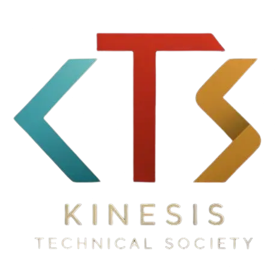

<div align="center">

  

  # Kinesis Technical Society (KTS)

  **Knowledge in Motion. Innovation in Action.**

  [](https://nextjs.org/)
  [](https://react.dev/)
  [](https://www.typescriptlang.org/)
  [](https://tailwindcss.com/)

</div>

---

## 🚀 Intro to KTS

**Kinesis Technical Society (KTS)** is a premier student-led technical community based at KIET Group of Institutions. We are dedicated to fostering innovation, open-source development, and technical excellence among emerging engineers and creators.

At KTS, we bridge the gap between theoretical learning and practical software engineering by giving students a collaborative workspace to build real-world projects, learn industry-grade skills, and network with passionate peers and mentors.

---

## 🌟 About KTS

### 💡 Our Mission
Our mission is to empower student developers, designers, and innovators by promoting hands-on learning and peer-to-peer knowledge sharing. We cultivate an inclusive ecosystem where creative ideas transform into impactful digital products.

### 🛠️ What We Do
* **Open Source Development**: We encourage and build open-source software, providing members with real-world experience in codebase contribution, code reviews, and modern Git workflows.
* **Workshops & Bootcamps**: We host hands-on training sessions covering Full-Stack Web Development, Cloud Infrastructure, AI/ML, DevOps, and modern UI/UX design.
* **Hackathons & Competitions**: We organize technical hackathons and coding challenges that inspire members to solve complex problems under real-world constraints.
* **Mentorship & Career Growth**: Our network of senior members, alumni, and industry mentors offers continuous guidance to help students excel in tech careers.

---

## 💻 Tech Stack & Architecture

This repository contains the official web platform for KTS, built with modern web technologies:

* **Frontend Framework**: Next.js 15 (App Router) & React 19
* **Styling**: Tailwind CSS v4 with custom responsive styling
* **Language**: TypeScript
* **State & Data**: React Hooks, JSON datasets, & Client Storage

---

## 📁 Project Structure

```
KTS_Official_website_2026/
├── frontend/             # Next.js frontend application
│   ├── app/              # Next.js App Router (pages & components)
│   ├── public/           # Static assets & public images (including kts-logo.webp)
│   └── package.json      # Dependencies and scripts
└── README.md             # Project documentation
```

---

## ⚡ Getting Started Locally

### 1. Prerequisites
Ensure you have [Node.js](https://nodejs.org/) (v18+ recommended) installed on your machine.

### 2. Installation
Navigate to the `frontend` directory and install the necessary dependencies:

```bash
cd frontend
npm install
```

### 3. Run Development Server
Start the local development server:

```bash
npm run dev
```

Open [http://localhost:3000](http://localhost:3000) in your browser to view the application.

---

## 🌐 Connect with KTS

Stay connected with our community through our official channels:

* **Instagram**: [@kinesis_technical_society](https://www.instagram.com/kinesis_technical_society/)
* **LinkedIn**: [Kinesis Technical Society](https://www.linkedin.com/company/kinesis-technical-society/)
* **X (Twitter)**: [@kts_kiet](https://x.com/kts_kiet)
* **Email**: [kts@kiet.edu](mailto:kts@kiet.edu)

---

<div align="center">
  Built with ❤️ by the Kinesis Technical Society Team
</div>